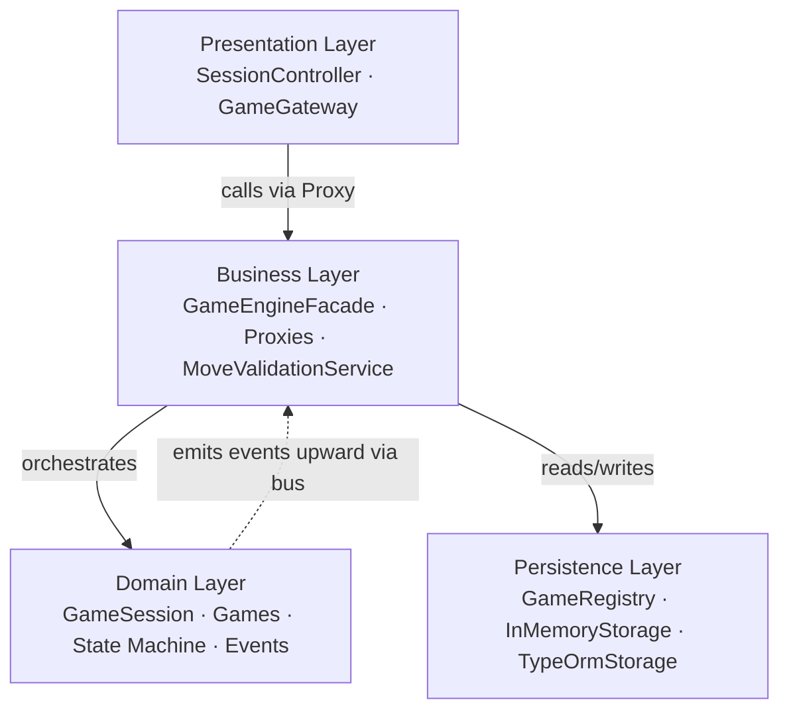
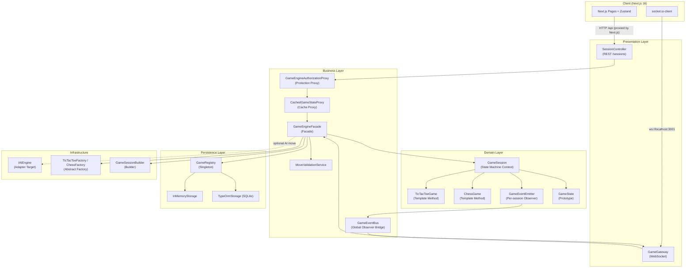
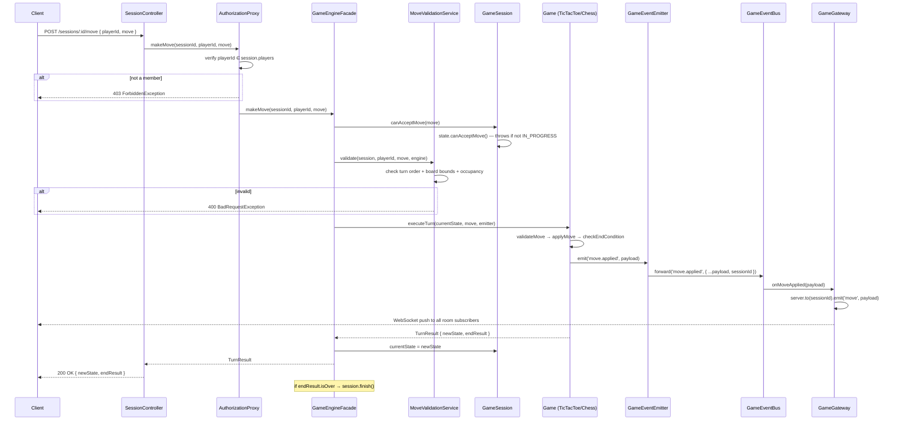
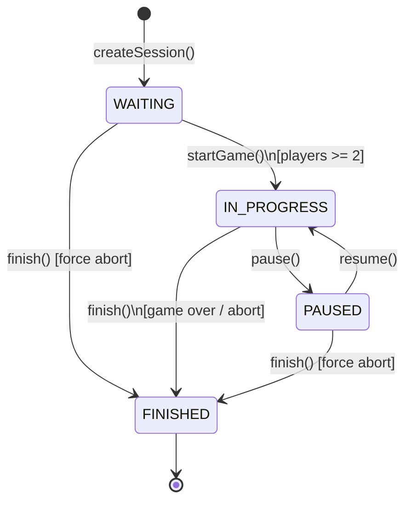
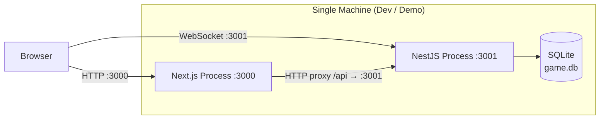

# Architecture Documentation

> Game Session Manager — Software Architecture Final Project

---

## 1. System Overview

**Game Session Manager** adalah sistem backend yang memungkinkan dua pemain bermain TicTacToe atau Chess secara real-time melalui browser. Sistem menerima permintaan melalui REST API dan WebSocket, mengelola lifecycle sesi permainan melalui state machine, dan mendistribusikan update ke semua subscriber secara push (Observer).

**Pengguna utama:**
- **Player** — membuat sesi, bergabung, dan mengirim move
- **Spectator** — menonton sesi aktif secara real-time
- **Frontend App** — mengkonsumsi REST API dan WebSocket

**Scope saat ini:** Monolith tunggal, single-process, single-machine. Data persisted di SQLite; state aktif disimpan in-memory di GameRegistry.

---

## 2. Architecture Style — Layered Architecture (Closed)

Sistem menggunakan **Closed Layered Architecture**: setiap lapisan hanya boleh berkomunikasi dengan lapisan langsung di bawahnya. Lapisan tidak boleh di-bypass.

**Justifikasi pemilihan Layered Architecture:**
- Tim kecil (4 orang) + timeline 2 minggu → monolith optimal vs microservices
- Bounded context jelas: game rules terpisah dari API handling
- Testability per-layer: domain logic tidak bergantung HTTP atau database
- Migration path: dapat berevolusi ke Hexagonal/Clean tanpa rewrite total

---

## 3. Layer Responsibilities

| Layer | Responsibility | Komponen Utama | Patterns Used |
|-------|---------------|----------------|--------------|
| **Presentation** | Terima HTTP/WS request, serialize/deserialize DTO, route ke business | `SessionController`, `GameGateway` | — |
| **Business** | Orkestrasikan use-case, enforce authorization, validasi move, emit events | `GameEngineFacade`, `AuthorizationProxy`, `CachedStateProxy`, `MoveValidationService` | Facade, Proxy ×2 |
| **Domain** | Aturan game murni, lifecycle state machine, event emission | `GameSession`, `TicTacToeGame`, `ChessGame`, `GameEventEmitter`, concrete states | Template Method, State, Observer, Prototype |
| **Persistence** | Simpan dan ambil session objects, provide in-memory cache | `GameRegistry`, `InMemoryStorage`, `TypeOrmStorage` | Singleton |
| **Infrastructure** | AI adapters, configuration, factory + builder | `IAIEngine`, `GameSessionBuilder`, `TicTacToeFactory`, `ChessFactory` | Abstract Factory, Builder, Adapter |

---

## 4. Component Diagram

---

## 5. Sequence Diagram — "Make a Move"

Flow lengkap ketika player mengirim move melalui REST API:

---

## 6. State Machine Diagram — Session Lifecycle

**State actions per state:**

| State | `makeMove` | `joinPlayer` | `pause` | `resume` | `finish` |
|-------|-----------|-------------|---------|---------|---------|
| WAITING | ❌ throws | ✅ allowed | ❌ throws | ❌ throws | ✅ allowed |
| IN_PROGRESS | ✅ allowed | ❌ throws | ✅ allowed | ❌ throws | ✅ allowed |
| PAUSED | ❌ throws | ❌ throws | ❌ throws | ✅ allowed | ✅ allowed |
| FINISHED | ❌ throws | ❌ throws | ❌ throws | ❌ throws | ❌ throws |

**Implementasi:** Tiap state adalah class terpisah (`WaitingForPlayersState`, `InProgressState`, `PausedState`, `FinishedState`) yang meng-implement `IGameLifecycleState`. `GameSession` mendelegasikan semua lifecycle ke state object saat ini — tidak ada `if/switch` di session class.

---

## 7. Deployment View

**Catatan produksi:**
- Gunakan Nginx sebagai reverse proxy untuk kedua proses
- Ganti SQLite dengan PostgreSQL untuk deployment multi-instance
- Tambahkan Redis untuk cross-process WebSocket broadcasting jika scale out

---

## 8. Cross-Cutting Concerns

| Concern | Mechanism | Location |
|---------|-----------|----------|
| **Authorization** | `GameEngineAuthorizationProxy` | `persistence/proxies/authorization.proxy.ts` |
| **Input Validation** | `MoveValidationService` + class-validator DTOs | `business/services/`, `presentation/dto/` |
| **Error Handling** | NestJS built-in exception filters | Global (HttpException hierarchy) |
| **Real-time sync** | Socket.io rooms per `sessionId` + `GameEventBus` | `presentation/gateways/game.gateway.ts` |
| **Configuration** | `AppConfigService` wraps `@nestjs/config` | `infrastructure/config/` |
| **API Docs** | `@nestjs/swagger` decorators | Auto-generated at `/api/docs` |
