# Design Patterns Reference

> Game Session Manager 11 GoF Design Patterns
> Grading artifact for Software Architecture Final Project

---

## Index

| # | Pattern | Category | File |
|---|---------|----------|------|
| 1 | [Singleton](#1-singleton) | Creational | `infrastructure/registry/game-registry.service.ts` |
| 2 | [Prototype](#2-prototype) | Creational | `business/domain/games/game-state.ts` |
| 3 | [Builder](#3-builder) | Creational | `business/builders/game-session.builder.ts` |
| 4 | [Abstract Factory](#4-abstract-factory) | Creational | `business/factories/` |
| 5 | [Template Method](#5-template-method) | Behavioral | `business/domain/games/game.abstract.ts` |
| 6 | [State](#6-state) | Behavioral | `business/domain/states/` |
| 7 | [Observer](#7-observer) | Behavioral | `business/domain/events/` |
| 8 | [Facade](#8-facade) | Structural | `business/facades/game-engine.facade.ts` |
| 9 | [Proxy Protection](#9-proxy--protection) | Structural | `persistence/proxies/authorization.proxy.ts` |
| 10 | [Proxy Cache](#10-proxy--cache) | Structural | `persistence/proxies/cached-game-state.proxy.ts` |
| 11 | [Adapter](#11-adapter) | Structural | `infrastructure/adapters/` |

---

## 1. Singleton

**Kategori:** Creational
**Sumber:** Coursework

### Intent
Memastikan hanya ada satu instance `GameRegistry` sepanjang lifetime aplikasi, sehingga semua bagian sistem mengakses registry yang sama dan tidak ada inkonsistensi state antar-request.

### Lokasi
`backend/src/infrastructure/registry/game-registry.service.ts`

### Participants

| Role | Class/Interface |
|------|----------------|
| Singleton | `GameRegistry` |
| Consumer | `GameEngineFacade`, `GameEngineAuthorizationProxy` |

### Kenapa Singleton, bukan alternatif?
NestJS default DI scope adalah singleton, tidak perlu `getInstance()` manual yang raw Singleton klasik perlukan. Ini membuat pattern idiomatik di framework: tetap satu instance, tetap testable (bisa di-mock di unit test), tetap bisa di-replace dengan implementasi lain via DI token.

Alternatif `static Map` di level modul ditolak karena tidak bisa di-mock dan menyulitkan testing.

### Code Snippet

```typescript
// backend/src/infrastructure/registry/game-registry.service.ts
@Injectable()  // NestJS default scope = singleton
export class GameRegistry {
  private readonly sessions = new Map<string, GameSession>();

  register(session: GameSession): void {
    this.sessions.set(session.id, session);
  }

  get(id: string): GameSession {
    const session = this.sessions.get(id);
    if (!session) throw new NotFoundException(`Session '${id}' tidak ditemukan.`);
    return session;
  }

  getAll(): GameSession[] {
    return Array.from(this.sessions.values());
  }
}
```

### UML

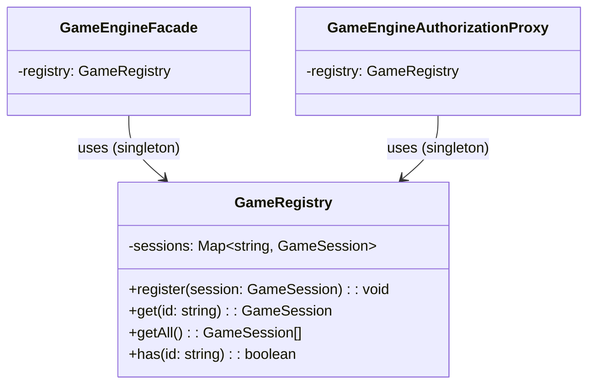

---

## 2. Prototype

**Kategori:** Creational
**Sumber:** Coursework

### Intent
Memungkinkan kloning `GameState` sebelum mutasi, sehingga "preview move" atau validasi bisa dilakukan tanpa mengubah state yang sedang aktif. Deep clone board array mencegah aliasing bugs.

### Lokasi
`backend/src/business/domain/games/game-state.ts`

### Participants

| Role | Class/Interface |
|------|----------------|
| Prototype Interface | `Cloneable<T>` |
| Concrete Prototype | `GameState` |
| Client (caller) | `TicTacToeGame.applyMove()`, `ChessGame.applyMove()` |

### Kenapa Prototype, bukan alternatif?
Tanpa `clone()`, setiap `applyMove` harus tahu cara membangun GameState baru secara manual, melanggar enkapsulasi. `clone()` juga memastikan deep-copy yang benar untuk array nested (board state) tanpa client perlu peduli detailnya.

Alternatif spread operator `{ ...state }` tidak cukup untuk nested array (board), akan terjadi shallow copy dan moves berikutnya akan merusak history.

### Code Snippet

```typescript
// backend/src/business/domain/games/game-state.ts
export class GameState implements Cloneable<GameState> {
  boardState: string[][];
  currentPlayerId: string;
  moveCount: number;
  playerOrder: string[];

  clone(): GameState {
    return new GameState({
      boardState: this.boardState.map((row) => [...row]),  // deep copy rows
      currentPlayerId: this.currentPlayerId,
      moveCount: this.moveCount,
      lastMoveTimestamp: this.lastMoveTimestamp,
      capturedPieces: [...this.capturedPieces],
      playerOrder: [...this.playerOrder],
    });
  }
}
```

### UML

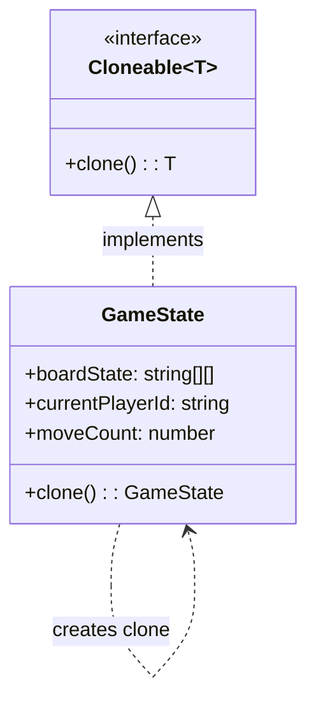

---

## 3. Builder

**Kategori:** Creational
**Sumber:** Coursework

### Intent
Memisahkan konstruksi `GameSession` (yang memiliki banyak parameter optional) dari representasinya. Builder memastikan objek hanya dibuat dalam kondisi valid dan memungkinkan reuse builder untuk session berikutnya via `reset()`.

### Lokasi
`backend/src/business/builders/game-session.builder.ts`

### Participants

| Role | Class/Interface |
|------|----------------|
| Product | `GameSession` |
| Concrete Builder | `GameSessionBuilder` |
| Director | `GameEngineFacade.createSession()` |

### Kenapa Builder, bukan alternatif?
`GameSession` memiliki 8+ parameter (gameType, players[], timeControl, isPrivate, allowSpectators, maxSpectators, status, currentState). Constructor biasa → telescoping constructor problem. Builder memberikan fluent API yang readable dan validasi terpusat di `build()`.

Alternatif Object Literal atau factory function tidak bisa enforce validasi mandatory field sebelum object dibuat.

### Code Snippet

```typescript
// Cara penggunaan di GameEngineFacade.createSession()
const session = this.builder
  .forGame(gameType)
  .addPlayer(players[0])
  .addPlayer(players[1])
  .build();  // throws jika gameType null atau players < 2

// Definisi builder (excerpt)
build(): GameSession {
  if (!this.gameType)
    throw new BadRequestException('Game type harus ditentukan sebelum build().');
  if (this.players.length < 2)
    throw new BadRequestException(`Session butuh minimal 2 player.`);

  const session = new GameSession({ id: randomUUID(), gameType: this.gameType,
    players: [...this.players], status: GameStatus.WAITING, /* ... */ });
  this.reset();  // builder siap dipakai lagi
  return session;
}
```

### UML

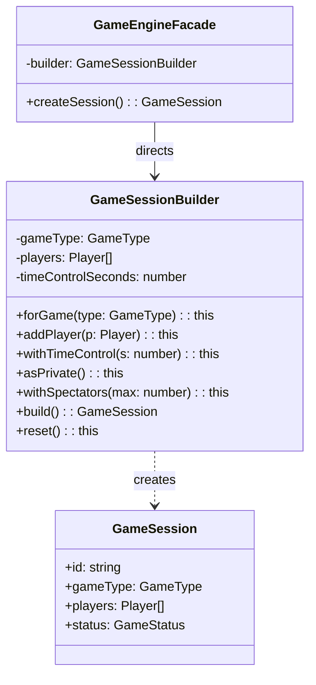

---

## 4. Abstract Factory

**Kategori:** Creational
**Sumber:** Coursework

### Intent
Menyediakan interface untuk membuat sekumpulan objek game yang saling compatible (Board + Rules + InitialState) tanpa menentukan concrete class-nya. Menambah game type baru hanya butuh satu factory baru, tidak ada perubahan di kode yang sudah ada.

### Lokasi
- Interface: `backend/src/business/factories/game-factory.interface.ts`
- TicTacToe: `backend/src/business/factories/tic-tac-toe.factory.ts`
- Chess: `backend/src/business/factories/chess.factory.ts`
- Provider: `backend/src/business/factories/game-factory.provider.ts`

### Participants

| Role | Class/Interface |
|------|----------------|
| Abstract Factory | `IGameFactory` |
| Concrete Factory 1 | `TicTacToeFactory` |
| Concrete Factory 2 | `ChessFactory` |
| Abstract Product A | `Board<string>` |
| Abstract Product B | `GameRules` |
| Abstract Product C | `GameState` (initial) |
| Client | `GameEngineFacade` via `GameFactoryProvider` |

### Kenapa Abstract Factory, bukan alternatif?
Alternatif switch-case di facade akan meledak saat game type bertambah dan melanggar OCP. Factory memastikan setiap game memiliki board, rules, dan initial state yang konsisten, tidak bisa secara tidak sengaja mix TicTacToe board dengan Chess rules.

### Code Snippet

```typescript
// Interface (Abstract Factory)
export interface IGameFactory {
  createBoard(): Board<string>;
  createRules(): GameRules;
  createInitialState(playerIds: [string, string]): GameState;
}

// Concrete Factory TicTacToe
@Injectable()
export class TicTacToeFactory implements IGameFactory {
  createBoard(): Board<string> {
    return { width: 3, height: 3,
      cells: Array.from({ length: 3 }, () => Array(3).fill('')) };
  }
  createInitialState(playerIds: [string, string]): GameState {
    return new GameState({ boardState: this.createBoard().cells,
      currentPlayerId: playerIds[0], playerOrder: [...playerIds] });
  }
}
```

### UML

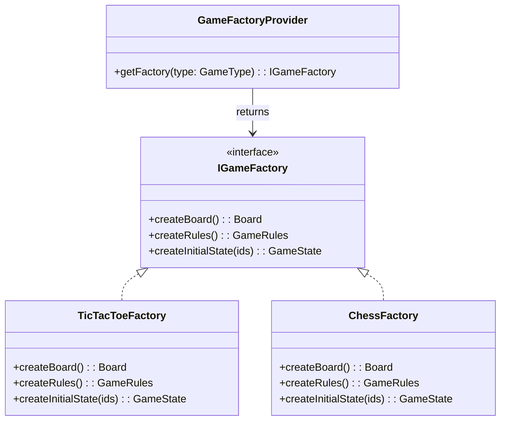

---

## 5. Template Method

**Kategori:** Behavioral
**Sumber:** Coursework

### Intent
Mendefinisikan skeleton algoritma satu giliran: `validate → apply → checkEnd → emit`. Urutan langkah tidak bisa diubah subclass; hanya implementasi tiap langkah yang berbeda per game type (TicTacToe vs Chess).

### Lokasi
`backend/src/business/domain/games/game.abstract.ts`

### Participants

| Role | Class/Interface |
|------|----------------|
| Abstract Class | `Game` |
| Template Method | `executeTurn()` |
| Primitive Operations | `validateMove()`, `applyMove()`, `checkEndCondition()` |
| Concrete Class 1 | `TicTacToeGame` |
| Concrete Class 2 | `ChessGame` |
| Client | `GameEngineFacade.makeMove()` |

### Kenapa Template Method, bukan alternatif?
Alternatif Strategy pattern (delegate seluruh turn ke strategy object) akan menduplikasi urutan langkah di setiap implementasi. Template Method menjamin urutan selalu validate-before-apply dan emit-after-apply tanpa bisa di-skip subclass.

### Code Snippet

```typescript
// backend/src/business/domain/games/game.abstract.ts
export abstract class Game {
  // Template Method final, tidak boleh di-override
  executeTurn(state: GameState, move: Move, emitter: GameEventEmitter): TurnResult {
    this.validateMove(state, move);               // hook 1
    const newState = this.applyMove(state, move); // hook 2
    const endResult = this.checkEndCondition(newState); // hook 3
    emitter.emit('move.applied', { newState, move, endResult });
    if (endResult.isOver) emitter.emit('game.finished', { endResult });
    return { newState, endResult };
  }

  // Primitive operations subclass WAJIB implement
  protected abstract validateMove(state: GameState, move: Move): void;
  protected abstract applyMove(state: GameState, move: Move): GameState;
  protected abstract checkEndCondition(state: GameState): EndCondition;
}
```

### UML

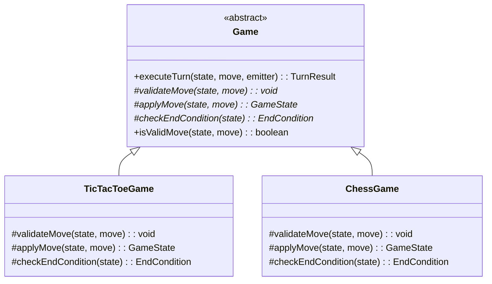

---

## 6. State

**Kategori:** Behavioral
**Sumber:** Coursework

### Intent
Mengelola lifecycle sesi (WAITING → IN_PROGRESS → PAUSED → FINISHED) dengan mendelegasikan setiap operasi ke concrete state object. Tiap state mendefinisikan sendiri mana operasi yang diizinkan dan mana yang di-throw, tidak ada `if/switch` di `GameSession`.

### Lokasi
- Interface: `backend/src/business/domain/states/game-lifecycle-state.interface.ts`
- `backend/src/business/domain/states/waiting-for-players.state.ts`
- `backend/src/business/domain/states/in-progress.state.ts`
- `backend/src/business/domain/states/paused.state.ts`
- `backend/src/business/domain/states/finished.state.ts`

### Participants

| Role | Class/Interface |
|------|----------------|
| State Interface | `IGameLifecycleState` |
| Context | `GameSession` (via `ISessionContext`) |
| Concrete State 1 | `WaitingForPlayersState` |
| Concrete State 2 | `InProgressState` |
| Concrete State 3 | `PausedState` |
| Concrete State 4 | `FinishedState` |

### Kenapa State, bukan alternatif?
4 lifecycle states × 6 operations = 24 branch kondisi jika pakai if-else. Setiap tambahan state butuh modifikasi di semua operasi. State pattern membuat tiap state self-contained dan extensible: tambah state baru → buat class baru, tidak ada perubahan di kelas lain.

### Code Snippet

```typescript
// WaitingForPlayersState move ditolak, join diizinkan
export class WaitingForPlayersState implements IGameLifecycleState {
  canAcceptMove(_session: ISessionContext, _move: Move): void {
    throw new BadRequestException('Game belum mulai. Tunggu hingga game di-start.');
  }

  startGame(session: ISessionContext): void {
    if (session.players.length < 2)
      throw new BadRequestException('Minimal 2 player untuk mulai.');
    session.transitionTo(new InProgressState());  // ubah state object
  }
}

// InProgressState move diizinkan, join ditolak
export class InProgressState implements IGameLifecycleState {
  canAcceptMove(_session: ISessionContext, _move: Move): void {
    // tidak throw move diizinkan saat IN_PROGRESS
  }

  joinPlayer(_session: ISessionContext, _player: Player): void {
    throw new BadRequestException('Game sudah berjalan.');
  }
}
```

### UML

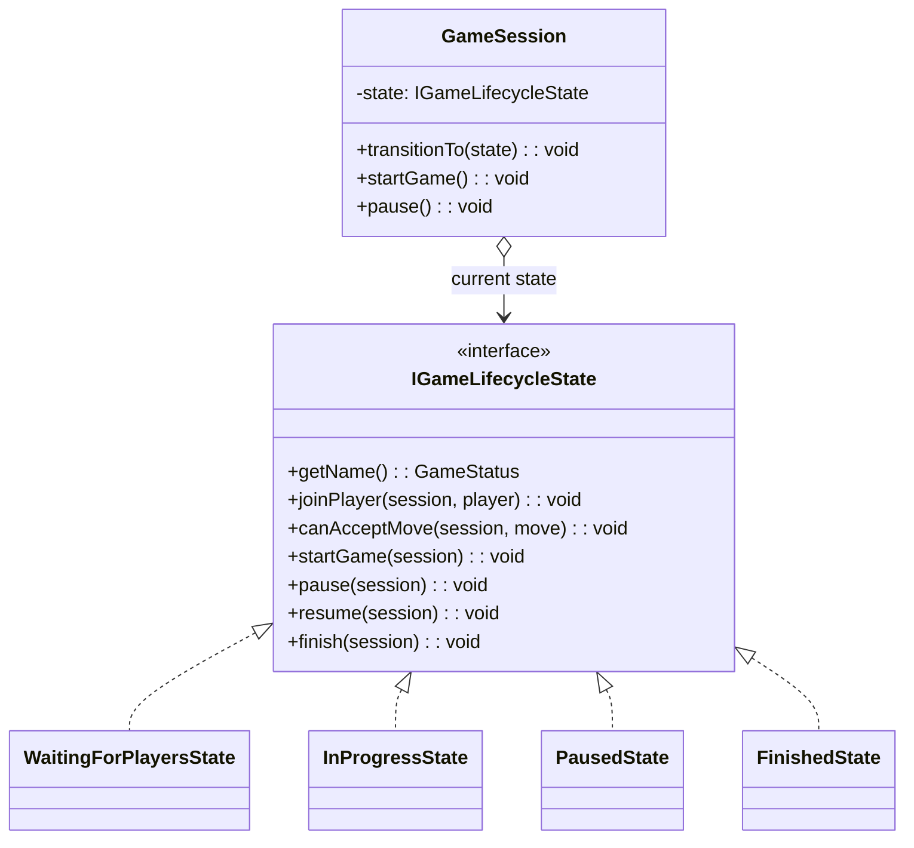

---

## 7. Observer

**Kategori:** Behavioral
**Sumber:** Coursework

### Intent
Decoupling antara game engine (subject) dan WebSocket Gateway (observer) game tidak perlu tahu siapa yang mendengarkan eventnya. Dua level observer: `GameEventEmitter` (per-session) dan `GameEventBus` (global bridge ke WebSocket).

### Lokasi
- `backend/src/business/domain/events/game-event-emitter.ts`
- `backend/src/business/events/game-event-bus.ts`
- `backend/src/presentation/gateways/game.gateway.ts`

### Participants

| Role | Class/Interface |
|------|----------------|
| Subject (per-session) | `GameEventEmitter` |
| Subject (global) | `GameEventBus` |
| Observer | `GameGateway` |
| Notification trigger | `Game.executeTurn()` |

### Kenapa Observer, bukan alternatif?
Direct call dari `GameEngineFacade` ke `GameGateway` akan menciptakan circular dependency (business layer → presentation layer = melanggar Layered Architecture). Observer membalik arah ketergantungan: presentation layer subscribe ke domain event, tidak sebaliknya.

### Code Snippet

```typescript
// GameEventEmitter strongly-typed event bus per session
export class GameEventEmitter {
  private readonly emitter = new EventEmitter();

  on<K extends keyof GameEventPayloads>(
    event: K,
    listener: (payload: GameEventPayloads[K]) => void,
  ): this {
    this.emitter.on(event, listener as (arg: unknown) => void);
    return this;
  }

  emit<K extends keyof GameEventPayloads>(event: K, payload: GameEventPayloads[K]): void {
    this.emitter.emit(event, payload);
  }
}

// Facade menjembatani per-session emitter ke global bus
session.emitter.on('move.applied', (p) =>
  this.eventBus.emit('move.applied', { ...p, sessionId: session.id }),
);
```

### UML

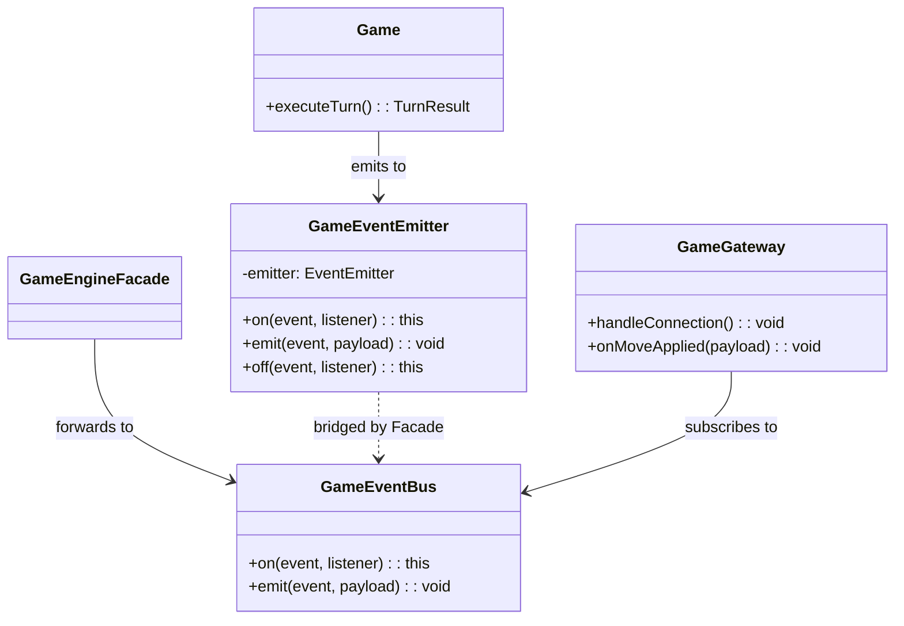

---

## 8. Facade

**Kategori:** Structural
**Sumber:** Coursework

### Intent
Menyediakan satu API sederhana untuk semua operasi game, menyembunyikan koordinasi internal yang kompleks antara `GameRegistry`, factory, builder, state machine, dan game engine. Controller dan Proxy tidak perlu tahu subsystem apa yang terlibat.

### Lokasi
`backend/src/business/facades/game-engine.facade.ts`

### Participants

| Role | Class/Interface |
|------|----------------|
| Facade | `GameEngineFacade` |
| Subsystem 1 | `GameRegistry` |
| Subsystem 2 | `GameFactoryProvider` |
| Subsystem 3 | `GameSessionBuilder` |
| Subsystem 4 | `TicTacToeGame`, `ChessGame` |
| Subsystem 5 | `MoveValidationService` |
| Subsystem 6 | `GameEventBus` |
| Client | `SessionController`, `GameEngineAuthorizationProxy` |

### Kenapa Facade, bukan alternatif?
Tanpa Facade, controller harus mengorkestrasi 6+ subsystem langsung controller jadi god class. Facade memisahkan "cara menggunakan" dari "cara kerja dalam", sesuai Single Responsibility Principle.

### Code Snippet

```typescript
// Controller cukup panggil satu method
// SessionController:
async makeMove(id: string, dto: MakeMoveDto) {
  return this.proxy.makeMove(id, dto.playerId, dto.move);
}

// Facade yang mengurus seluruh flow:
async makeMove(sessionId: string, playerId: string, move: Move): Promise<TurnResult> {
  const session = this.registry.get(sessionId);  // subsystem 1
  session.canAcceptMove(move);                    // state machine guard
  const engine = this.engines.get(session.gameType); // subsystem 4
  this.validationService.validate(session, playerId, move, engine); // subsystem 5
  const result = engine.executeTurn(session.currentState, move, session.emitter);
  session.currentState = result.newState;
  if (result.endResult.isOver) session.finish();
  return result;
}
```

### UML

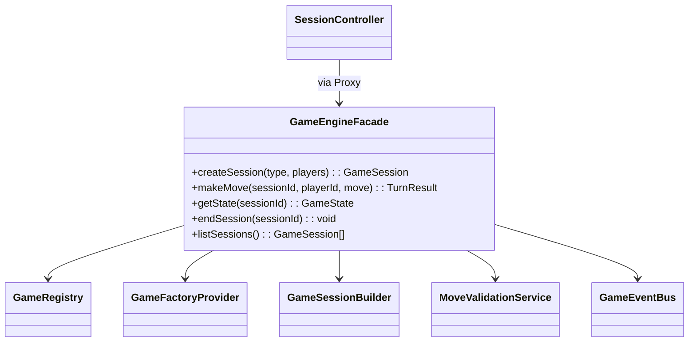

---

## 9. Proxy Protection

**Kategori:** Structural
**Sumber:** Coursework

### Intent
Mencegat setiap operasi mutasi dan memvalidasi bahwa pemohon adalah player yang terdaftar di sesi sebelum meneruskan ke `GameEngineFacade`. Authorization logic terpisah dari business logic.

### Lokasi
`backend/src/persistence/proxies/authorization.proxy.ts`

### Participants

| Role | Class/Interface |
|------|----------------|
| Real Subject | `GameEngineFacade` |
| Proxy | `GameEngineAuthorizationProxy` |
| Client | `SessionController` |

### Kenapa Proxy, bukan middleware atau guard?
NestJS Guard berjalan di layer HTTP dan tidak bisa diuji tanpa HTTP context. Authorization Proxy adalah plain class yang dapat diuji dengan unit test biasa, dan bisa di-stack dengan Proxy lain (Cache Proxy). Ini memisahkan concern authorization dari business logic secara jelas.

### Code Snippet

```typescript
// backend/src/persistence/proxies/authorization.proxy.ts
@Injectable()
export class GameEngineAuthorizationProxy {
  constructor(
    private readonly real: GameEngineFacade,
    private readonly registry: GameRegistry,
  ) {}

  async makeMove(sessionId: string, playerId: string, move: Move): Promise<TurnResult> {
    const session = this.registry.get(sessionId);
    const isRegisteredPlayer = session.players.some((p) => p.id === playerId);

    if (!isRegisteredPlayer) {
      throw new ForbiddenException(
        `Player '${playerId}' bukan anggota sesi '${sessionId}'.`,
      );
    }
    return this.real.makeMove(sessionId, playerId, move); // delegate to facade
  }
}
```

### UML

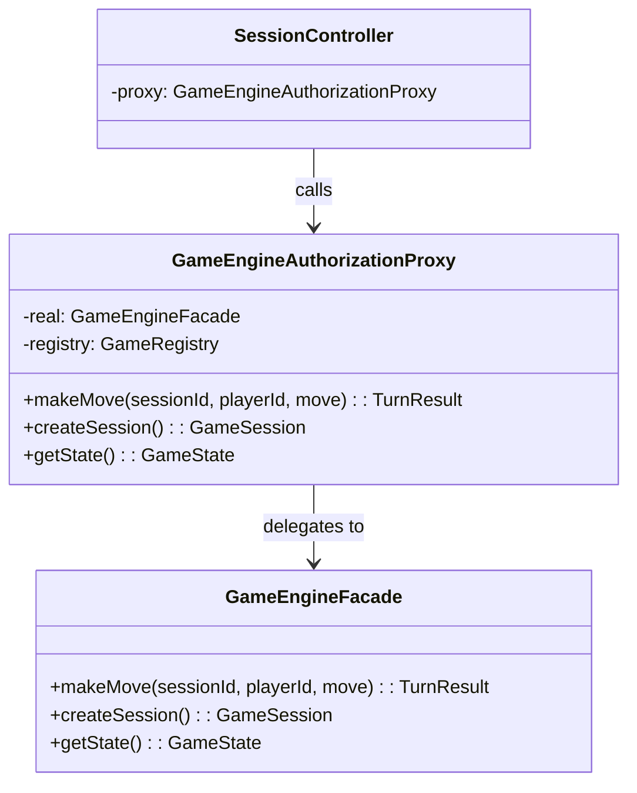

---

## 10. Proxy Cache

**Kategori:** Structural
**Sumber:** Coursework

### Intent
Meng-cache hasil `getState()` dengan TTL 1 detik sehingga spectator broadcast yang memanggil getState berulang kali dalam waktu singkat tidak memicu registry lookup berulang. Cache diinvalidasi otomatis saat event `move.applied` diterima.

### Lokasi
`backend/src/persistence/proxies/cached-game-state.proxy.ts`

### Participants

| Role | Class/Interface |
|------|----------------|
| Real Subject | `GameEngineFacade` |
| Proxy | `CachedGameStateProxy` |
| Cache | `Map<string, CacheEntry>` (in-process) |

### Kenapa Cache Proxy, bukan decorator atau interceptor?
Cache di-proxy level lebih efisien dari HTTP caching (tidak perlu serialize/deserialize). Auto-invalidasi via event `move.applied` menjamin freshness data client tidak pernah melihat state stale lebih dari 1 detik setelah move dieksekusi.

### Code Snippet

```typescript
// backend/src/persistence/proxies/cached-game-state.proxy.ts
async getState(sessionId: string): Promise<GameState> {
  const cached = this.cache.get(sessionId);
  if (cached && Date.now() - cached.ts < this.TTL_MS) {
    return cached.state;  // serve from cache
  }

  const state = await this.facade.getState(sessionId);

  if (!this.subscribed.has(sessionId)) {
    // Subscribe sekali untuk auto-invalidate saat ada move
    const session = this.facade.getSession(sessionId);
    session.emitter.on('move.applied', () => this.invalidate(sessionId));
    this.subscribed.add(sessionId);
  }

  this.cache.set(sessionId, { state, ts: Date.now() });
  return state;
}
```

### UML

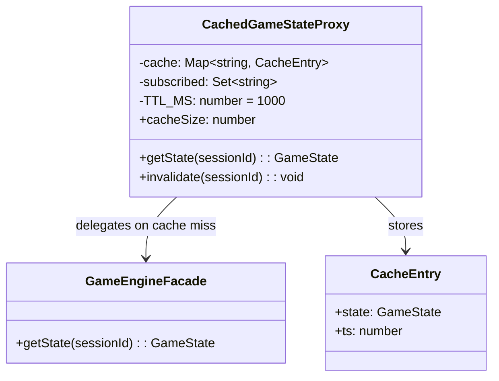

---

## 11. Adapter

**Kategori:** Structural
**Sumber:** Coursework

### Intent
Menyatukan tiga implementasi AI move generation yang berbeda (Random, Minimax, External engine) di balik satu interface `IAIEngine` yang seragam. `GameEngineFacade` hanya kenal interface, implementasi AI bisa di-swap tanpa mengubah satu baris kode facade.

### Lokasi
- Interface (Target): `backend/src/infrastructure/adapters/ai-engine.interface.ts`
- `backend/src/infrastructure/adapters/random-ai.adapter.ts`
- `backend/src/infrastructure/adapters/minimax-ai.adapter.ts`
- `backend/src/infrastructure/adapters/external-engine.adapter.ts`

### Participants

| Role | Class/Interface |
|------|----------------|
| Target Interface | `IAIEngine` |
| Concrete Adapter 1 | `RandomAiAdapter` |
| Concrete Adapter 2 | `MinimaxAiAdapter` |
| Concrete Adapter 3 | `ExternalEngineAdapter` |
| Client | `GameEngineFacade` (via `AI_ENGINE_TOKEN`) |

### Kenapa Adapter, bukan strategi langsung?
Setiap AI engine memiliki API berbeda (random tidak async-heavy, minimax butuh depth parameter, external engine butuh HTTP call). Adapter membungkus perbedaan ini dan menyajikan interface seragam. Injeksi via token `AI_ENGINE_TOKEN` memungkinkan swap runtime tanpa compile ulang.

### Code Snippet

```typescript
// Target interface yang dikenal facade
export interface IAIEngine {
  getNextMove(state: GameState, gameType: GameType): Promise<Move>;
}

// RandomAiAdapter adaptasi strategi random ke IAIEngine
@Injectable()
export class RandomAiAdapter implements IAIEngine {
  async getNextMove(state: GameState, gameType: GameType): Promise<Move> {
    switch (gameType) {
      case GameType.TIC_TAC_TOE: return this.randomTicTacToeMove(state);
      case GameType.CHESS:       return this.randomChessMove(state);
    }
  }

  private randomTicTacToeMove(state: GameState): TicTacToeMove {
    const emptyCells = state.boardState.flatMap((row, r) =>
      row.map((cell, c) => cell === '' ? [r, c] : null).filter(Boolean));
    const [row, col] = emptyCells[Math.floor(Math.random() * emptyCells.length)];
    return { gameType: GameType.TIC_TAC_TOE, playerId: state.currentPlayerId, row, col };
  }
}
```

### UML

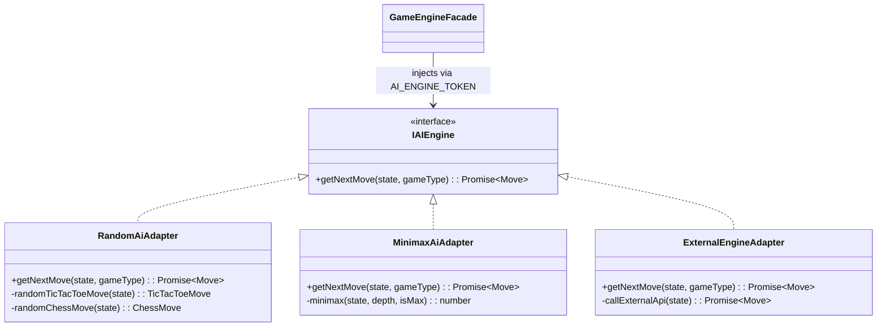
